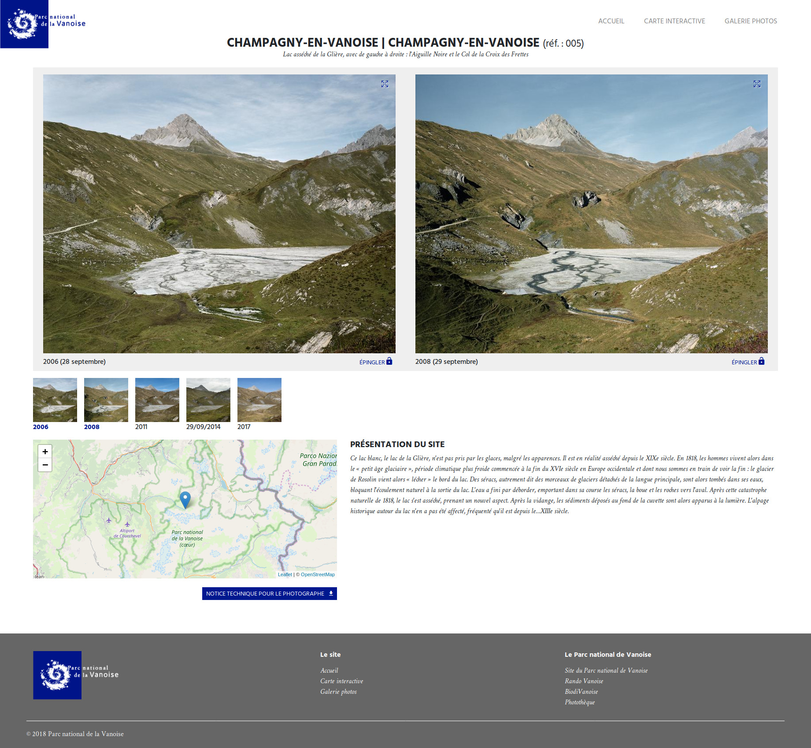

# GeoPaysages

Application web permettant de publier un observatoire photographique des paysages.

## Install
Documentation d'installation : https://github.com/PnX-SI/GeoPaysages/tree/master/docs/installation.rst

- Créer et activer un environnement virtuel python 3.
- cd ./backend
- Exécuter pip install -r ./requirements.txt
- Dupliquer et renommer ./config.py.tpl vers ./config.py
- Editer la config
- Lancer l'app FLASK_APP=./app.py FLASK_DEBUG=1 flask run

## Contexte

L'Observatoire photographique des paysages de Vanoise a été mis en place en 2006 pour suivre l'évolution des paysages au sein du Parc national de la Vanoise à travers des séries de photographies reconduites, sur des sites définis, selon le même cadrage. Les gardes-moniteurs assurent régulièrement les prises de vue.

Le site internet initial de l'OPPV a été mis hors service mi-2016 en raison du changement de plateforme internet (mutualisation de tous les sites des Parcs nationaux). Ce site était articulé sur la carte interactive avec des accès multiples, par exemple les référence des sites, mots-clés paysagers etc. Il présentait 189 sites photographiques, dont 103 sont encore suivis aujourd'hui par reconductions régulières. Il y ades données photographiques et textuelles pour l'ensemble des sites photos.

Un nouveau site internet grand public va être mis en oeuvre pour partager au plus grand nombre le travail effectué depuis la création de l'Observatoire photographique des paysages.

Le projet est porté par le Parc national de la Vanoise. Le site qui sera développé courant 2018 sera sous licence libre. Dans la même lignée que GeoNature, le projet sera générique et disponible pour les autres parcs nationaux et pour d'autres structures depuis ce repository. La prestation de développement par la société Natural Solutions va débuter courant mai 2018.

A suivre...

 

## Présentation

- CCTP 2017 : http://geonature.fr/documents/autres/geopaysages/2017-11-13-CDC-OPPV-PNV.pdf
- Annexe CCTP 2017 : http://geonature.fr/documents/autres/geopaysages/2017-11-24-OPPV-PNV-ANNEXES-CDC.zip
- Réflexion 2016 : http://geonature.fr/documents/autres/geopaysages/2016-11-OPP-reflexion.pdf

## DEMO 

http://5.196.209.137/

